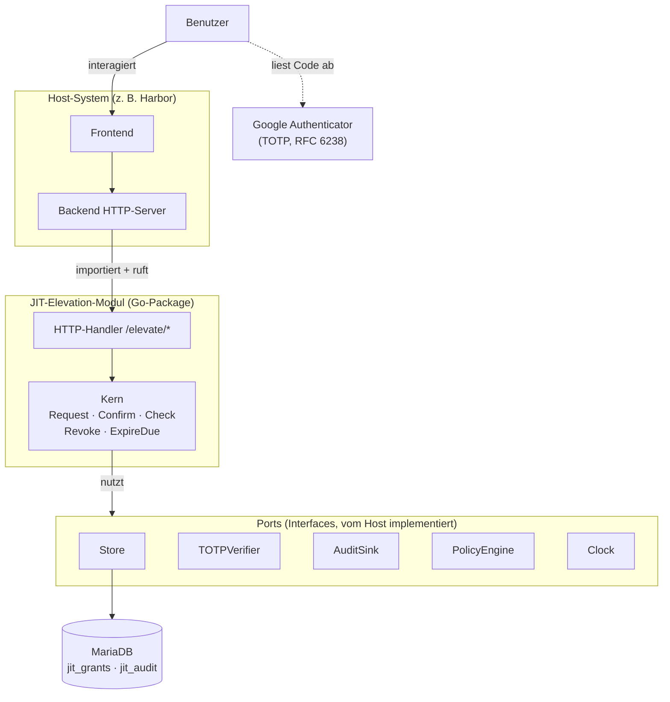
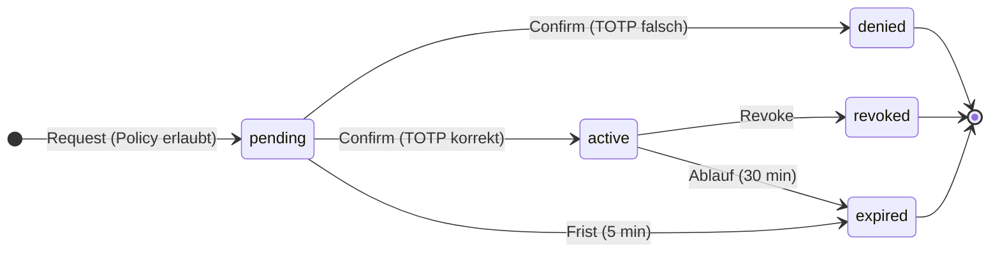
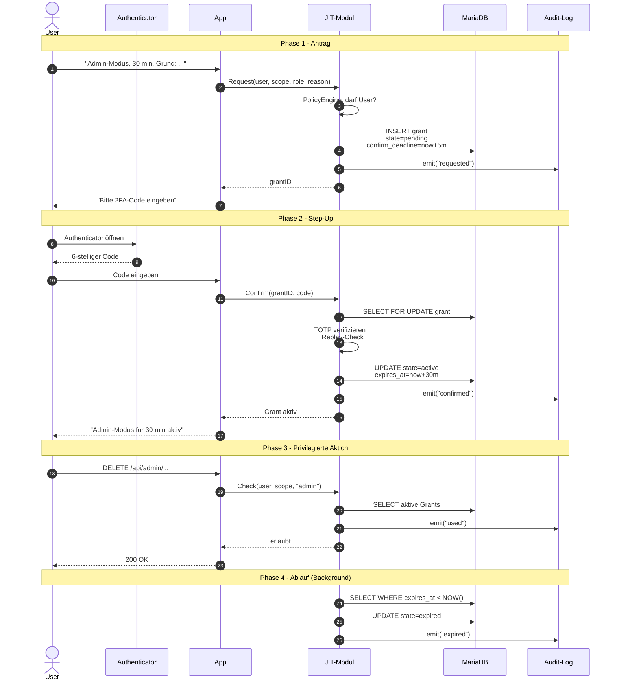
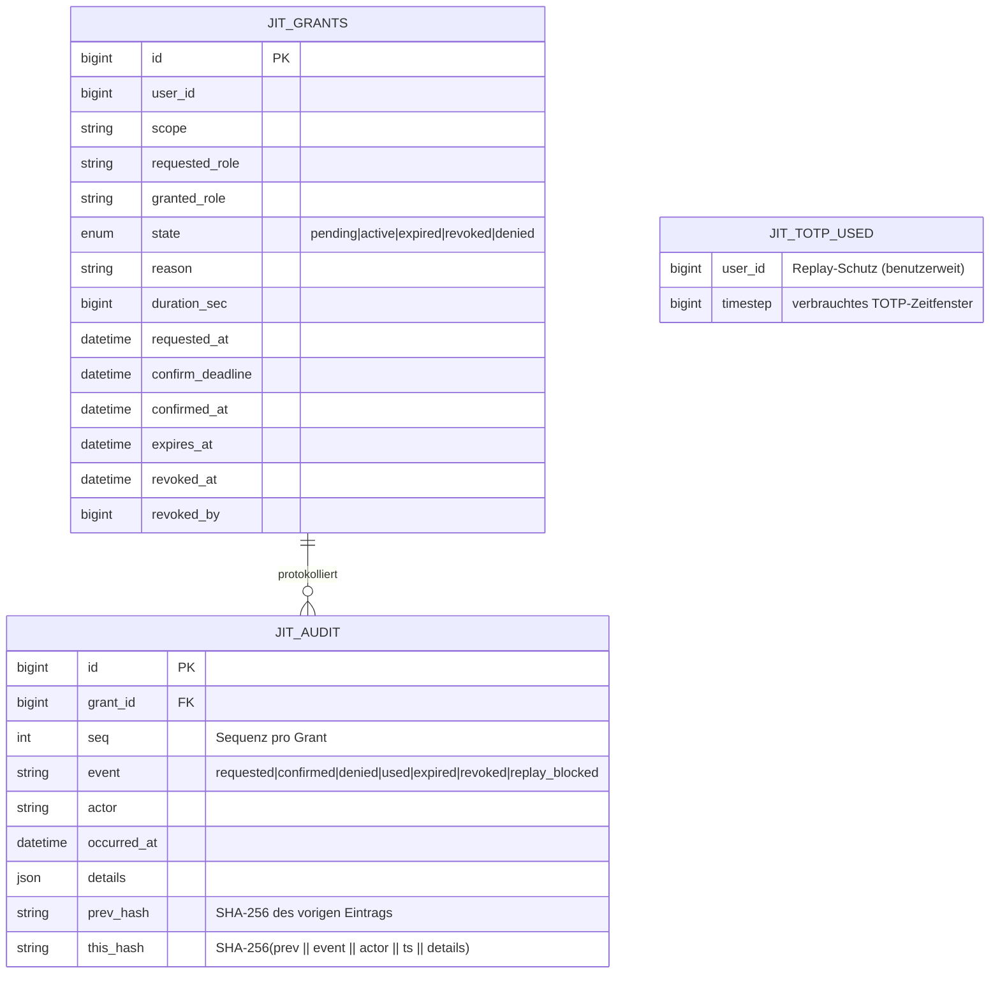
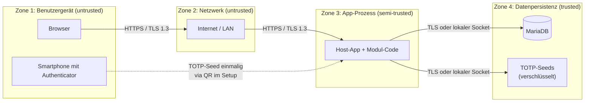

# JIT-Elevation-Modul — Visuelle Übersicht

Diese Datei sammelt die Diagramme, die das Konzept des Moduls beschreiben.
Sie dient als visuelle Grundlage für die Projektarbeit.

---

## 1. Architektur-Übersicht (System-Kontext)

Zeigt, wie das Modul in einen Host (z. B. Harbor) eingebettet wird und
welche Verantwortung wo liegt.

**Kernaussage:** Das Modul kennt den Host nicht — es spricht ausschließlich
gegen Interfaces. Der Host liefert konkrete Implementierungen. Damit ist
das Modul wiederverwendbar und unabhängig vom Trägersystem testbar.

---

## 2. State-Machine eines Grants

Beschreibt den vollständigen Lebenszyklus einer Rechte-Erhöhung —
von Antrag bis zum terminalen Zustand.

**Kernaussage:** Alle Endzustände sind terminal. Ein expired/revoked/denied
Grant kann nicht reaktiviert werden — das ist die zentrale fail-closed-
Eigenschaft des Modells.

---

## 3. Hauptflow — Request, Confirm, Use, Expire

Zeigt den vollständigen Ablauf inklusive Step-Up-Authentication mit TOTP.

**Kernaussage:** Phase 2 ist der Step-Up-Moment. Ohne
erfolgreichen TOTP entsteht kein aktiver Grant — keine Hintertür,
keine Sonderfälle.

---

## 4. Datenmodell (ER-Diagramm)

Die drei Tabellen, die das Modul anlegt (Grants, Audit-Log und die
verbrauchten TOTP-Zeitfenster für den Replay-Schutz). Die Audit-Tabelle
hat eine Hash-Chain für Integrität.

**Kernaussage:** Die Hash-Chain in `jit_audit` macht jede nachträgliche
Manipulation eines Log-Eintrags erkennbar — der nächste Eintrag bricht
die Kette.

---

## 5. Vertrauensgrenzen (Trust Boundaries)

Wo verlässt eine Information eine Vertrauenszone? Das ist die Grundlage
für das STRIDE-Threat-Model.

**Kernaussage:** Drei Grenzen müssen kryptografisch geschützt sein:
Browser↔Backend (TLS), Backend↔DB (TLS oder Unix-Socket), und der
TOTP-Seed verlässt nie die Datenpersistenz im Klartext.

---

## Hinweise zur Nutzung in der Arbeit

| Diagramm | Eignet sich für Kapitel |
|---|---|
| 1. Architektur | Konzept / Modul-Architektur, Adapter-Pattern |
| 2. State-Machine | Konzept / Grant-Lebenszyklus, fail-closed Argument |
| 3. Sequenzdiagramm | Konzept / Ablauf, Sicherheit / Step-Up-Moment |
| 4. ER-Diagramm | Implementierung / Datenmodell |
| 5. Trust Boundaries | Sicherheitsanalyse / STRIDE-Vorbereitung |
